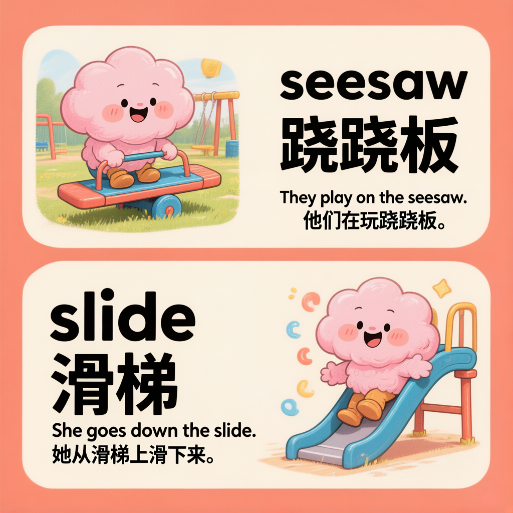
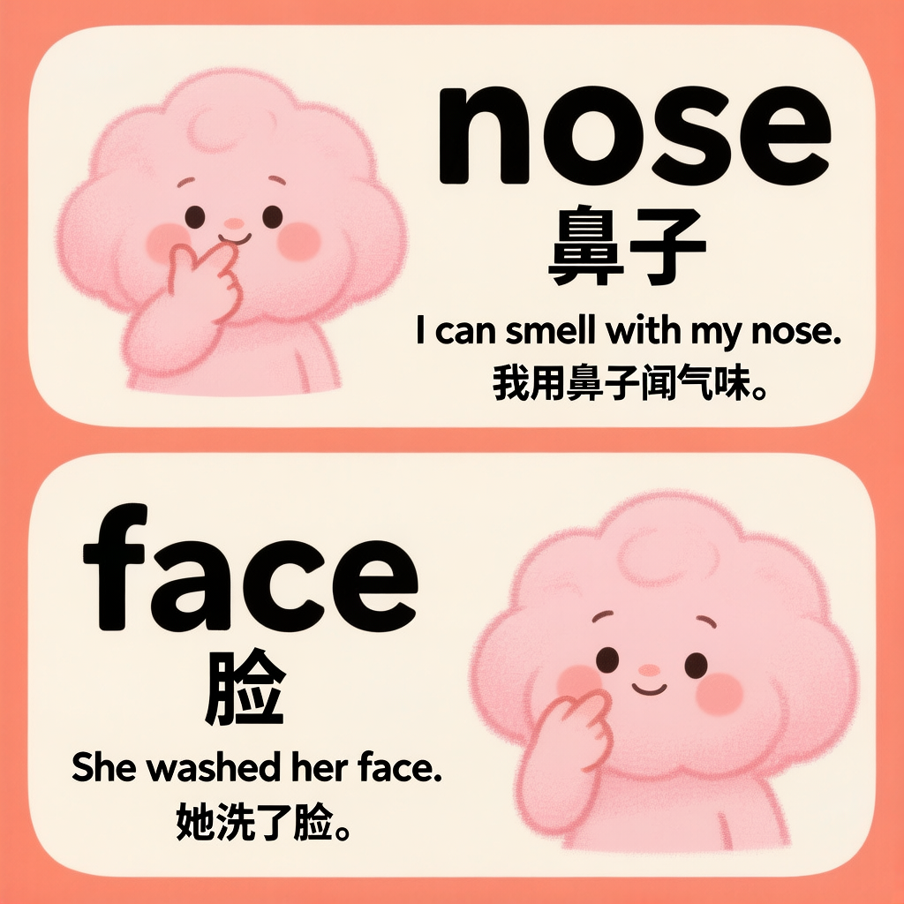
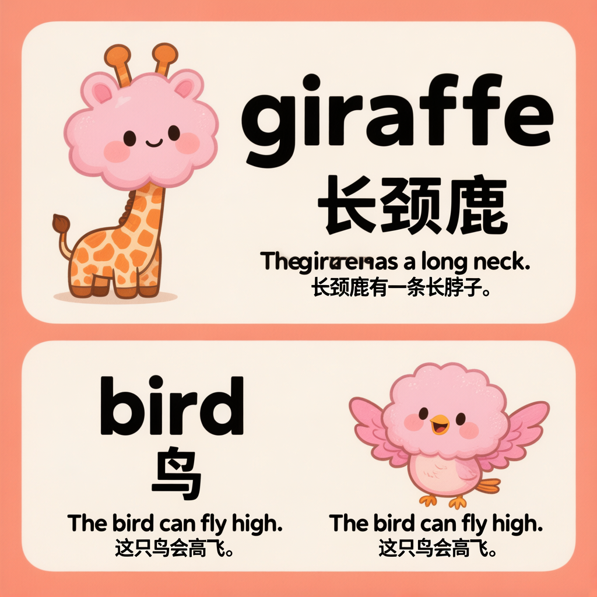
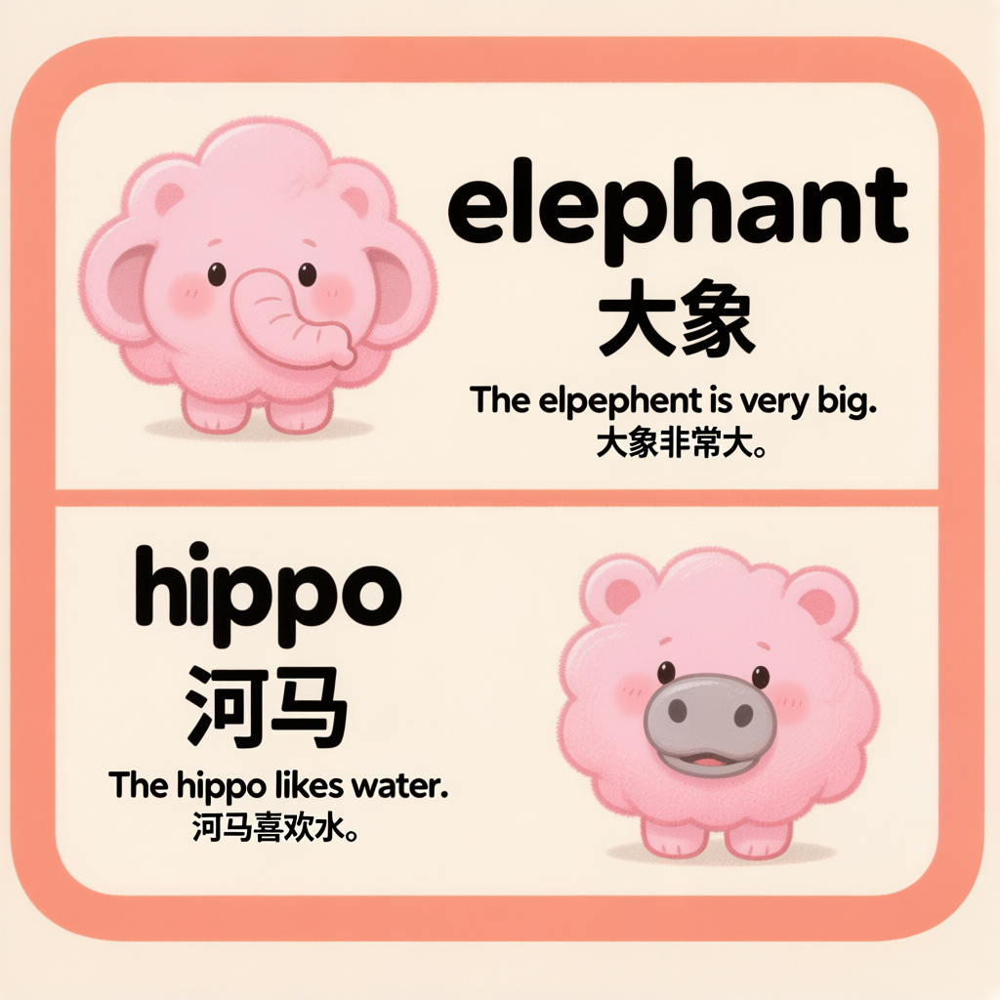
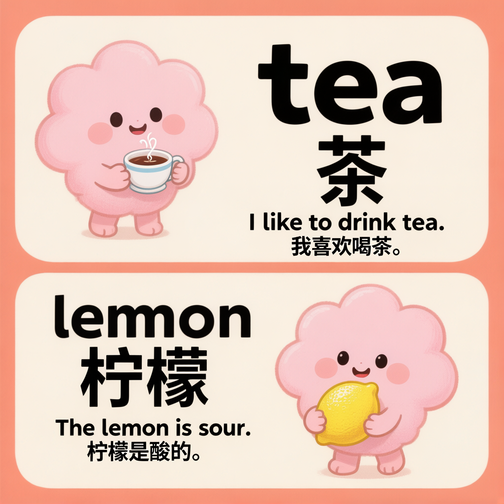

# Flashcard Generator - English Word Flashcard Skill

<p align="center">
  
</p>

A **WorkBuddy AI Skill** that generates cute, kawaii-style bilingual (English + Chinese) word flashcards for children's English learning. Just provide two English words and get a beautiful flashcard image in seconds.

## Features

- **Two words per card** - Each flashcard teaches two related or contrasting words
- **Bilingual** - English word + Chinese translation + example sentence with translation
- **Kawaii style** - Pink fluffy cloud characters with blush, warm cream background, coral orange accents
- **Child-friendly** - Simple sentences, cute illustrations, perfect for ages 3-8
- **One-click generation** - Just say "生成闪卡: word1 word2"

## Sample Flashcards

| Word 1 | Word 2 | Preview |
|--------|--------|---------|
| nose | face |  |
| giraffe | bird |  |
| elephant | hippo |  |
| tea | lemon |  |
| coffee | cookie |  |
| seesaw | slide |  |

## How to Use

1. Install this skill to your WorkBuddy
2. Say something like:
   - `生成闪卡 "apple" "banana"`
   - `制作单词卡片 cat dog`
   - `flashcard sun moon`

That's it! The AI will generate a cute bilingual flashcard for you.

## Installation

Copy the entire contents of this repo into your WorkBuddy skills directory:

```bash
cp -r . ~/.workbuddy/skills/flashcard-generator/
```

Or install via WorkBuddy's skill manager.

## File Structure

```
flashcard-generator/
├── SKILL.md                    # Core skill definition & prompt
├── README.md                   # This file
├── LICENSE                     # MIT License
├── assets/
│   └── style_reference.png     # Visual style reference image
├── scripts/
│   └── generate_flashcard.py   # Card rendering script (optional)
└── examples/                   # Generated sample cards
```

## How It Works

This skill uses an **AI image generation** model to render flashcards:

1. Parse user input (2 English words)
2. Generate Chinese translations and example sentences
3. Build a detailed visual prompt describing layout, style, characters, text
4. Call the image generator with a [style reference image](assets/style_reference.png)
5. Return the generated PNG

The prompt engineering is carefully designed so each card has:
- **Top half**: illustration on left, word on right
- **Bottom half**: word on left, illustration on right (mirrored layout)
- Consistent pink cloud mascot, cream background, orange accents

## Customization

You can customize the SKILL.md to change:

- **Color scheme** (background/border colors)
- **Mascot style** (cloud character description)
- **Card ratio** (default 3:4 vertical)
- **Language pair** (currently EN→CN)

## License

[MIT](LICENSE) - Free to use, modify, and distribute.

## Author

Created by [Leah Chen](https://github.com/) - A product manager mom building AI tools for her kid Ryan's English learning journey.

---

Made with love for little learners.
